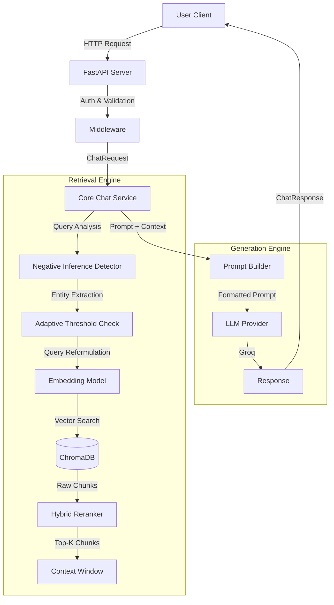

# System Architecture & Implementation Guide

This document serves as the primary technical reference for the Personal RAG System. It details the architecture, component interactions, and current configuration of the application.

## 🏗️ High-Level Architecture

The system is a Retrieval-Augmented Generation (RAG) application built with **FastAPI**. It orchestrates interactions between a user, a vector database (**ChromaDB**), and Large Language Models (**Groq** / **Ollama**).



## 🧩 Core Components

### 1. API Layer (`app/api`, `app/main.py`)
-   **Framework**: FastAPI
-   **Entry Point**: `app/main.py` initializes the app, middlewares, and routes.
-   **Middleware**:
    -   `APIKeyMiddleware`: Simple header-based authentication (`X-API-Key`).
    -   `MaxSizeMiddleware`: Protects against large payloads (default 32KB).
    -   `LoggingMiddleware`: Structured logging for observability.
    -   `CORSMiddleware`: Allows requests from local frontend (`localhost:3000`).

### 2. Core Logic (`app/core/chat_service.py`)
The `ChatService` class is the heart of the application. It orchestrates the RAG flow:
1.  **Receives Request**: Validates input and checks for chitchat/ambiguity.
2.  **Negative Inference Detection**: Analyzes query for entities that may not exist in the knowledge base.
3.  **Query Reformulation**: If needed, reformulates query from entity-specific to category-wide search.
4.  **Retrieval**: Fetches relevant documents from ChromaDB using semantic search.
5.  **Reranking**: Refines results using hybrid semantic + lexical scoring.
6.  **Grounding Check**: Verifies if retrieved content is relevant (distance threshold).
7.  **Generation**: Constructs a prompt and calls the LLM.

### 3. Retrieval Engine (`app/retrieval`, `app/ingest`)
-   **Vector Store**: ChromaDB (persistent storage in `./data/chroma`).
-   **Embeddings**: `sentence-transformers` (Default: `BAAI/bge-small-en-v1.5`).
-   **Negative Inference**: Detects missing entities and reformulates queries (`app/retrieval/negative_inference_helper.py`).
-   **Adaptive Thresholding**: Data-driven entity existence detection using distance gap analysis (`app/retrieval/adaptive_threshold.py`).
-   **Reranker**: Re-scores retrieved chunks using hybrid semantic + lexical scoring.
-   **Ingestion**: Scripts in `app/ingest` process Markdown files from `./data/mds`, chunk them, and load them into ChromaDB.

### 4. LLM Providers (`app/services/llm.py`)
The system uses a focused approach:
-   **Groq (Exclusive)**: High-speed inference for production responsiveness.
    -   Model: `llama-3.1-8b-instant` (configurable)
    -   Legacy local model support (Ollama) has been deprecated to streamline the architecture.

## ⚙️ Configuration & Settings

All configuration is managed via `pydantic` in `app/settings.py` and can be overridden by `.env` variables.

| Category | Key Setting | Env Var | Default | Description |
| :--- | :--- | :--- | :--- | :--- |
| **LLM** | Provider | `LLM_PROVIDER` | `groq` | Must be `groq`. |
| | Groq Key | `LLM_GROQ_API_KEY` | - | Required if using Groq. |
| **Retrieval** | Top K | `TOP_K` | `5` | Number of chunks to retrieve. |
| | Rerank | `RERANK` | `true` | Enable/disable reranking step. |
| | Max Distance | `MAX_DISTANCE` | `0.60` | Maximum cosine distance for retrieval. |
| **Negative Inference** | Threshold | `NEGATIVE_INFERENCE_THRESHOLD` | `0.37` | Distance threshold for entity existence. |
| | Method | `NEGATIVE_INFERENCE_METHOD` | `gap_based` | Method: `fixed`, `gap_based`, or `context_aware`. |
| **Security** | API Key | `API_KEY` | `change-me` | Simple auth token. |

## 🚀 Data Flow: The Life of a Request

1.  **User** sends `POST /chat` with `{"question": "Do I have a PhD?"}`.
2.  **API** authenticates the request.
3.  **ChatService** performs pre-retrieval checks:
    -   Chitchat detection (greetings, thanks, etc.)
    -   Ambiguity detection (too vague queries)
4.  **Negative Inference Detection**:
    -   Extracts potential entities from question ("PhD")
    -   Uses adaptive thresholding to check if entity exists in KB
    -   If entity doesn't exist, reformulates query to search for category ("education degrees")
5.  **Retrieval**:
    -   Embeds the (possibly reformulated) question using BGE v1.5
    -   Queries ChromaDB for the top `RERANK_RETRIEVAL_K` (e.g., 50) chunks
    -   Applies metadata filters if specified (doc_type, term_id, level)
6.  **Reranking**:
    -   Hybrid reranker scores chunks using semantic + lexical matching
    -   The top `TOP_K` (e.g., 5) chunks are selected
7.  **Grounding Check**:
    -   Verifies best chunk distance is below `null_threshold`
    -   If not, returns "I don't know" response
8.  **Prompt Building**:
    -   Chunks are formatted into a context block
    -   System prompt constructed with grounding instructions
    -   Negative inference hints added if applicable
9.  **Generation**:
    -   Prompt sent to active LLM provider (Groq)
    -   LLM generates answer based on provided context
10. **Response**: JSON response returned with answer, sources, and grounding status.

## 🛠️ Current Functionality Status

-   ✅ **Basic RAG**: Fully functional.
-   ✅ **Hybrid Search**: Enabled (Vector + Reranking).
-   ✅ **Negative Inference Detection**: Automatically handles queries about non-existent entities.
-   ✅ **Adaptive Thresholding**: Data-driven entity existence detection.
-   ✅ **Multi-turn Conversation**: Supported via `session_id` (history injection + context retrieval).
-   ✅ **Multi-Provider LLM**: Consolidated to **Groq-only** for performance and simplicity.
-   ✅ **Observability**: Prometheus metrics exposed at `/metrics`.

## ⚠️ Known Issues & Limitations

### Ambiguity Detection Insufficient
The system's ambiguity detection (implemented in `chat_service.py`) is **not aggressive enough**:

**Problem**: Pre-retrieval ambiguity checks are too lenient, allowing vague or ambiguous questions to proceed to retrieval and generation when they should request clarification instead.

**Symptoms**:
- Questions like "My experience?" or "Projects?" attempt to answer instead of asking for clarification
- Responses may be overly broad, generic, or not match user intent
- Some automated tests receive unexpected answers because the system guesses at ambiguous intent
- The system tries to answer when it should recognize insufficient information

**Current Implementation** (`chat_service.py`):
```python
if _is_truly_ambiguous(request.question, conversation_history):
    # Only catches extremely vague cases (1-2 words)
    # Checks history to allow short follow-ups like "When?"
```

**Why This Design Choice:**

The system uses **simple rule-based ambiguity detection** instead of sophisticated LLM-based detection for practical reasons:

1. **Token Budget Constraints**:
   - To maximize queries within token limits, prompts must be kept concise
   - Extensive ambiguity detection instructions would consume valuable input tokens
   - Each token used for detection reduces tokens available for context chunks

2. **Cost & Latency Optimization**:
   - Sophisticated ambiguity detection would require an **additional LLM call** before the main RAG pipeline
   - Current design: 1 LLM call per query (fast, free)
   - Enhanced design: 2 LLM calls per query (slower, costlier)
   - The system prioritizes keeping operations free and responsive

3. **Single-Pass Architecture**:
   - The entire RAG pipeline completes in one LLM invocation
   - Pre-retrieval → Retrieval → Generation → Response (single flow)
   - Adding LLM-based ambiguity detection would require two-phase processing

**Trade-off**: The current implementation prioritizes **availability** (always try to answer), **efficiency** (minimal tokens, single LLM call), and **cost** (free to operate) over **precision** (only answer clear queries). This means users get responses to ambiguous queries, but those responses may not match their actual intent.

**Impact on Testing**: If running test suites, expect some tests to receive answers that don't match expected outputs because the system attempts to answer ambiguous questions instead of requesting clarification. This is an intentional design constraint to keep the system efficient and free to operate.
